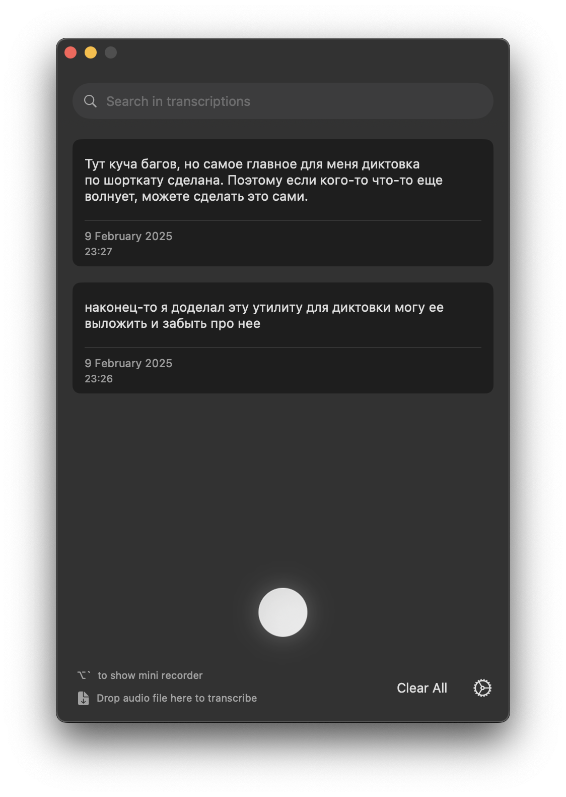
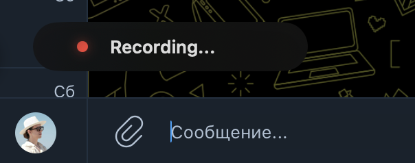

# NeuType

NeuType is a macOS application for fast voice-to-text on Apple Silicon Macs.

 

## Features

- 🎙️ Real-time audio recording and transcription
- ☁️ Cloud ASR via Groq (`whisper-large-v3`)
- ⌨️ Start recording with a single modifier key (Multi Button mode)
- 📁 Drag & drop audio files for transcription with queue processing
- 🎤 Microphone selection — switch between built-in, external, Bluetooth and iPhone (Apple Continuity) mics from the menu bar
- ✨ Optional transcript cleanup with LLM post-processing

## Installation

Download from the [GitHub Releases page](https://github.com/chenhaoran0612/neuType/releases).

## Requirements

- macOS (Apple Silicon/ARM64)

## Support

If you encounter any issues or have questions, please:
1. Check the existing issues in the repository
2. Create a new issue with detailed information about your problem
3. Include system information and logs when reporting bugs

## Building locally

To build locally, you'll need:

    git clone git@github.com:chenhaoran0612/neuType.git
    cd NeuType
    git submodule update --init --recursive
    brew install cmake libomp rust ruby
    gem install xcpretty
    ./run.sh build

In case of problems, consult `.github/workflows/build.yml` which is our CI workflow
where the app gets built automatically on GitHub's CI.

## Contributing

Contributions are welcome! Please feel free to submit pull requests or create issues for bugs and feature requests.

## License

NeuType is licensed under the MIT License. See the [LICENSE](LICENSE) file for details.
